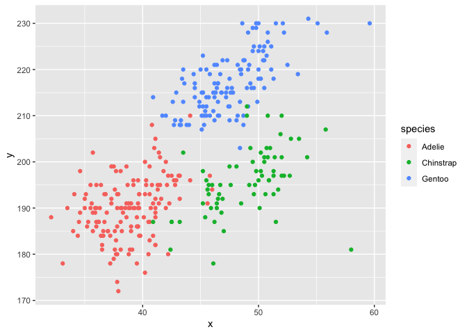

p8105\_hw1\_sz3030
================
Shaocong Zhang
9/27/2021

# Problem 1

``` r
library(tidyverse)
```

    ## ── Attaching packages ─────────────────────────────────────── tidyverse 1.3.1 ──

    ## ✓ ggplot2 3.3.5     ✓ purrr   0.3.4
    ## ✓ tibble  3.1.4     ✓ dplyr   1.0.7
    ## ✓ tidyr   1.1.3     ✓ stringr 1.4.0
    ## ✓ readr   2.0.1     ✓ forcats 0.5.1

    ## ── Conflicts ────────────────────────────────────────── tidyverse_conflicts() ──
    ## x dplyr::filter() masks stats::filter()
    ## x dplyr::lag()    masks stats::lag()

``` r
prob1_tab = tibble(
  norm_samp = rnorm(10),
  log_vec = norm_samp > 0,
  char_vec = c("a", "b", "c", "d", "e", "f", "g", 'h', "i", "j"),
  fac_vec = factor(c("easy", "median", "hard", "easy", "median", "hard", "easy", "median", "hard", "easy"))
)

# mean of the random sample
mean(pull(prob1_tab, norm_samp))
```

    ## [1] 0.1125309

``` r
# mean of the logical vector
mean(pull(prob1_tab, log_vec))
```

    ## [1] 0.6

``` r
# mean of the character vector
mean(pull(prob1_tab, char_vec))
```

    ## Warning in mean.default(pull(prob1_tab, char_vec)): argument is not numeric or
    ## logical: returning NA

    ## [1] NA

``` r
# mean of the factor vector
mean(pull(prob1_tab, fac_vec))
```

    ## Warning in mean.default(pull(prob1_tab, fac_vec)): argument is not numeric or
    ## logical: returning NA

    ## [1] NA

Based the mean values of each variable, we can get that the character
vector and the factor vector don’t work while the random sample and
logical vector work.

``` r
# use as.numeric function to the logical variable
as.numeric(pull(prob1_tab, log_vec))
# use as.numeric function to the character variable
as.numeric(pull(prob1_tab, char_vec))
# use as.numeric function to the factor variable
as.numeric(pull(prob1_tab, fac_vec))
```

The logical and factor variables are successfully converted to the
numeric variables while the character variable still cannot be
converted.

The logical variable is thought to be 0 or 1 as default to represent
FALSE or TRUE, respectively. So it is not surprising that logical
variable has mean value.

The factor variable is also arranged specific values to represent
different levels in the variable once we use `as.numeric` vector. But
there doesn’t have a default value in the factor variable so that we
cannot get its mean directly.

For the character variable, we cannot use `as.numeric` vector to assign
numbers to its characters and therefore it helps explain why we cannot
get the mean in the previous chunck.

# Problem 2

``` r
data("penguins", package = "palmerpenguins")
```

The dataset contains several variables of the penguins, they are
species, island, bill\_length\_mm, bill\_depth\_mm, flipper\_length\_mm,
body\_mass\_g, sex, year. There are three species Adelie, Chinstrap,
Gentoo in this dataset and the number of data we collected from the
three species are 152, 68, 124, respectively. What’s more, this is a 344
X 8 dataset and the mean flipper length we get from the dataset is
200.92.

``` r
# We first pull the X-Y variables from the dataset and make a data frame
plot_prob2 = tibble(
  y = penguins$flipper_length_mm,
  x = penguins$bill_length_mm,
  species = penguins$species
)

ggplot(plot_prob2, aes(x = x, y = y, colors = species)) + geom_point()
```

<!-- -->

``` r
ggsave("hw1_scatter_plot.pdf")
```

    ## Saving 7 x 5 in image
